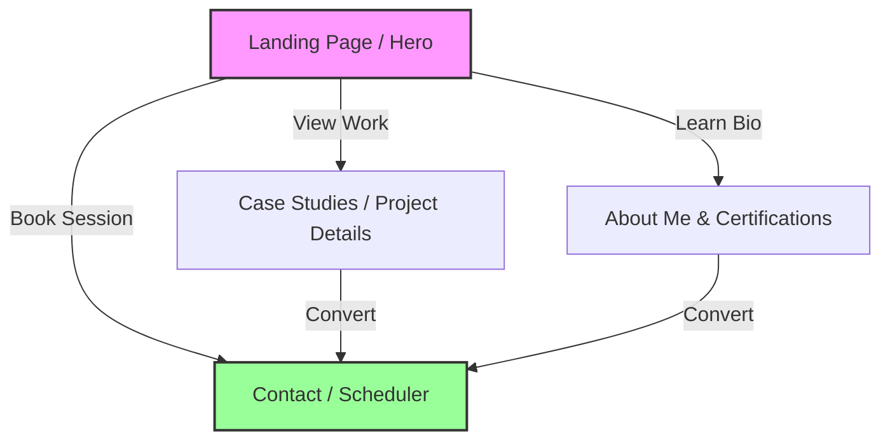
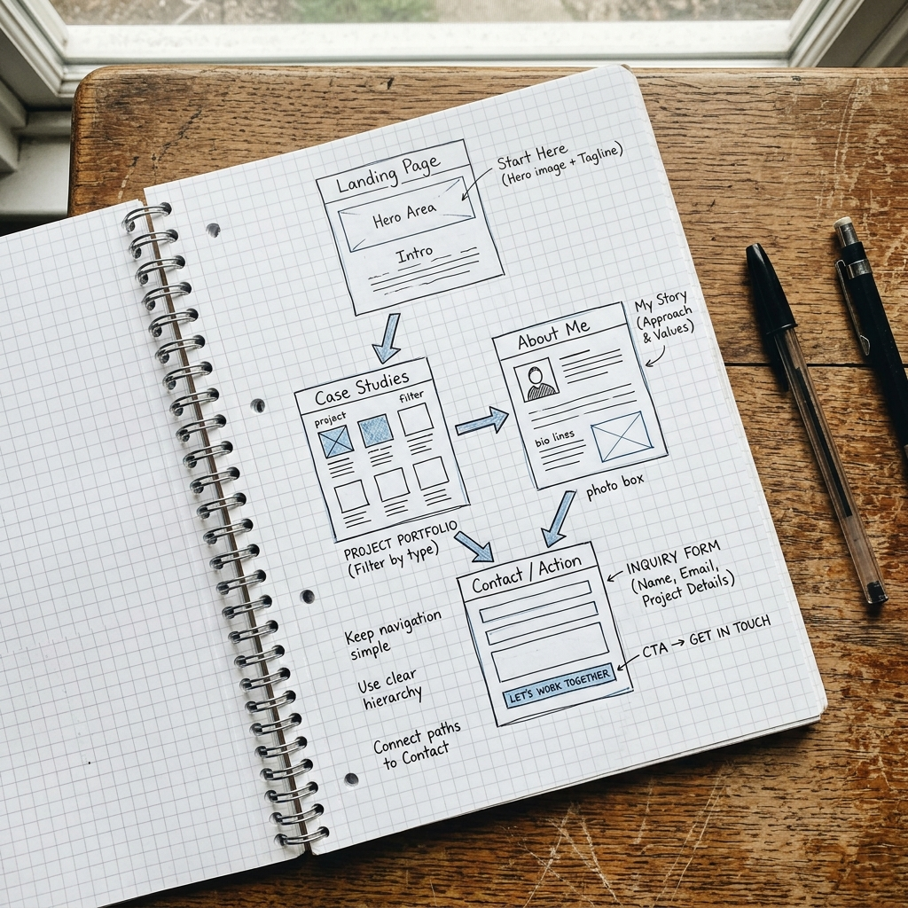

# FL-01: Draw the Path (Portfolio Sitemap)
**Track:** General AI Fluency  
**Phase:** Onboarding (Week 1)  
**Date:** July 17, 2026  
**Author:** Uday (Software Engineer Intern, FlyRank)  

---

## 1. Strategy & Path Definition

Every element of this portfolio is designed to lead **one specific person** to believe **one claim** and take **one action**.

* **Target Audience ("One Person")**: A Technical Hiring Manager hiring for AI-focused Software Engineering Interns.
* **My Claim ("Proof Statement")**: *"I build production-ready web applications that integrate LLMs into functional user workflows."*
* **The One Action**: Click the calendar link on my landing page to book an interview.
* **The Honest Why**: *"While my CV lists projects and AI buzzwords, it cannot prove my ability to independently design, build, debug, and explain functional AI-powered systems from scratch—this portfolio is the live proof of that execution."*

---

## 2. Sitemap Structure

To prevent bloat and maintain a laser focus on the one action, the sitemap is kept strictly to **four pages**.



### Page Breakdown
1. **Landing/Hero Page**: States the core claim instantly, displays a live mini-demo of the `farmer-trade-system` marketplace, and places a primary Call to Action (CTA) button to book a call.
2. **Case Studies (Work)**: Provides technical write-ups proving the claim. Focuses on system architecture, database performance (sub-2 second load times), and test suite execution (100% path coverage).
3. **About Me**: Brief background, skill matrix, and proof of AI Fluency (including this workflow audit and Anthropic certifications).
4. **Contact Page**: A minimal, dedicated page embedding an interactive calendar scheduler (e.g., Cal.com/Calendly) representing the **One Action**.

---

## 3. Visual Sitemap Sketch

Below is the hand-drawn UI wireframe and sitemap sketch representing the visual flow of the portfolio.



---

## 4. Claude Project (Tutor Setup)

A dedicated Claude Project has been created to guide the eight-week build.

* **Project Name**: `portfolio-tutor-build`
* **Project Role**: Act as an expert software engineering tutor and portfolio consultant.

### Custom Instructions (System Prompt)
```markdown
# Role & Instruction
You are an expert full-stack developer and a strict software engineering tutor. Your goal is to guide me through building my portfolio over the next 8 weeks. 

# Project Context & Claim
I am building a high-performance portfolio. 
- Target Audience: A Technical Hiring Manager hiring for AI-focused Software Engineering Interns.
- Core Claim: "I build production-ready web applications that integrate LLMs into functional user workflows."
- Primary Action: Get the visitor to book an interview slot.

# Guidelines
- Act as a tutor: Do not just write all the code for me. Ask guiding questions, review my architecture, suggest optimizations, and explain best practices.
- Focus on testing: Frequently ask about test coverage and path verification.
- Enforce performance: Ensure all code snippets and suggestions optimize for sub-2-second load times and efficient database queries.
```

---

## 5. Sitemap Pressure-Testing

To validate the sitemap, the first prompt was run inside the configured Claude Project to pressure-test the layout against the core claim and one action.

### The Pressure-Test Prompt
> *"Here is my proposed 4-page sitemap: Landing (Hero + Demo), Case Studies (Tech Stack + Metrics), About Me (Bio + Skills), and Contact (Calendly Embed). My claim is: 'I am a full-stack engineer who builds responsive, AI-integrated agricultural trading applications that load in under 2 seconds and achieve 100% path coverage.' My action is to get the visitor to book a call. Review this map. Does every page earn its place? Is there any friction?"*

### Claude's Response (Output Summary)
```markdown
1. **Landing Page**: Earns its place. Showing the live demo instantly supports the "agricultural trading applications" claim and gives immediate proof.
2. **Case Studies**: Earns its place. This is where you prove the "under 2 seconds" and "100% path coverage" parts of your claim with real metrics and code snippets.
3. **About Me**: Potential Friction. A standard about page can feel generic. If it just lists hobbies or soft skills, it dilutes the claim. 
4. **Contact Page**: Earns its place. This is the "One Action."

**Recommendation**: Merge the "About Me" section directly into the bottom of the Landing Page or keep it incredibly short. Ensure your Case Studies page links directly to the Contact scheduler at the bottom of every project.
```

### Reflection & Refinement
* **What I will change based on the pressure test**: I will eliminate the separate "About Me" page to reduce user friction. Instead, I will integrate a small "About Uday" section containing my technical toolkit and AI Fluency credentials directly onto the main **Landing Page**. This simplifies the sitemap to **three pages** (Landing, Case Studies, and Contact), ensuring that the visitor is never more than one click away from the Case Studies and the Booking scheduler.

---

## 6. Tool Setup Verification

The following tools have been initialized to support my developer workflow:

1. **Claude (Anthropic)**: Account configured; Project `portfolio-tutor-build` active.
2. **ChatGPT (OpenAI)**: Active for quick utility scripts and general coding questions.
3. **Gemini (Google)**: Active for code analysis and context explanations.
4. **Perplexity (Search)**: Active for searching current documentation, API schemas, and library changes.

---
*End of Report*
