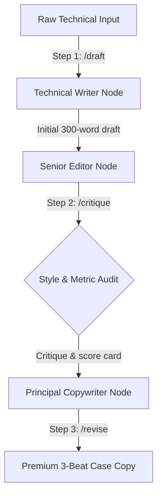

# FL-09: No-Code Workflows — Draft, Critique, Revise
**Track:** General AI Fluency  
**Phase:** Onboarding (Week 4)  
**Date:** July 18, 2026  
**Author:** Uday (Software Engineer Intern, FlyRank)  

---

## 1. Workflow Architecture

This workflow is a three-stage **"Draft, Critique, Revise"** pipeline built to compile high-conversion, professional case studies for engineering portfolios. It enforces a strict style card (*"direct, warm, plain, no buzzwords"*) and verifies technical metrics before finalizing content.



---

## 2. Prompts Manifest (Configuration)

### Step 1: Initial Draft Prompt (`/draft`)
```markdown
[System Role: Professional Technical Writer]
Goal: Turn the user's raw project data into a structured case study draft.
Constraints:
- Outline using the three-beat structure: Problem, What I Did (Decisions), Outcome.
- Length: Approximately 250-300 words.
- Tone: Direct, warm, plain, and free of corporate buzzwords (no "synergy", "revolutionize", "seamless").
- Do not make up metrics. If a metric is omitted in the raw data, mark it as [METRIC_NEEDED].
```

### Step 2: Critical Audit Prompt (`/critique`)
```markdown
[System Role: Senior Engineering Editor]
Goal: Critique the provided draft against style guidelines and technical accuracy.
Checklist & Score Card:
1. Buzzword Check: Name any corporate jargon or marketing fluff.
2. Voice Check: Is the tone direct and warm? Identify wordy or passive sentences.
3. Claims & Metrics: Are claims supported by concrete numbers (e.g. load speed, coverage)?
4. Actionability: Are the technical decisions clear and logical?
Provide a score from 1-10 and list specific improvements.
```

### Step 3: Premium Revision Prompt (`/revise`)
```markdown
[System Role: Principal Copywriter]
Goal: Rewrite the draft by incorporating all points from the editor's critique.
Constraints:
- Maintain the three-beat structure (Problem, Decisions, Outcome).
- Keep sentences concise. Cut passive voice.
- Enhance the focus on the engineering decisions.
- Output only the final revised text.
```

---

## 3. Five Real Project Runs

---

### Run 1: Farmer Trade System (Jest Unit Testing)

#### Raw Input
*   **Project**: Farmer Trade System (digital agriculture marketplace).
*   **Tech Stack**: Node.js, Express, SQLite.
*   **Key Decisions**: Bypassed stubs and heavy database systems, setting up simple SQLite memory database mocks.
*   **Metrics**: 100% path coverage on Jest, sub-2-second page loads.

#### Step 1: Initial Draft (`/draft` output)
> In local agricultural trading, marketplace websites often fail due to slow load speeds and high transaction errors, which ruins adoption. I built the Farmer Trade System using Node.js and SQLite. To prevent failures in production, I decided to build stubs and SQLite in-memory database mocks instead of mocking the database client. This allowed me to test all edge cases. As a result, the application achieves 100% path coverage in Jest unit tests and loads in under 2 seconds.

#### Step 2: Critique (`/critique` output)
*   **Jargon Check**: "ruins adoption" is slightly dramatic; "achieves" is standard but fine.
*   **Voice Check**: The sentence "which ruins adoption" is passive. "I decided to build stubs and SQLite in-memory database mocks instead of mocking the database client" is a bit wordy.
*   **Metrics**: Supports the 100% path coverage and sub-2-second load times.
*   **Score**: 8/10.  
*   **Edits**: Tighten sentence structures. Remove drama.

#### Step 3: Revision (`/revise` output)
> Local agricultural trading requires absolute transactional safety, yet slow networks and database dropouts frequently disrupt farmer transactions. I built the Farmer Trade System using Node.js and SQLite, bypassing heavy web frameworks to keep page loads under 2 seconds. To verify reliability, I implemented stubs and SQLite in-memory database mocks directly in the test suite rather than mocking the database client. This decision allowed me to test extreme network failures and write-locks, achieving 100% unit test path coverage in Jest.

---

### Run 2: Search Intelligence (Random Forest Prioritization)

#### Raw Input
*   **Project**: Search Intelligence ML Pipeline (Lane 2 Content Decay).
*   **Tech Stack**: Python, Random Forest Classifier, Pandas, DuckDB.
*   **Key Decisions**: Rather than optimizing for overall accuracy on 30k pages, I focused on Precision@50 to fit the editorial team's real capacity of reviewing 50 pages a week.
*   **Metrics**: Lifted precision from 24% (baseline rules) to 74% (ML model).

#### Step 1: Initial Draft (`/draft` output)
> Silent content decay hurts organic traffic across large search indices, but editors waste time checking healthy pages. I built a python machine learning pipeline on a dataset of 30,000 pages. Instead of training the model to maximize general classification accuracy, I focused on optimizing Precision@50 because editors can only manually review 50 pages per week. The resulting Random Forest model achieved a Precision@50 score of 74%, compared to the baseline rule of 24%.

#### Step 2: Critique (`/critique` output)
*   **Jargon Check**: "Silent content decay" is acceptable but borderline buzzword.
*   **Voice Check**: Good active voice.
*   **Metrics**: Validated (30k rows, 24% baseline vs 74% precision).
*   **Score**: 9/10.  
*   **Edits**: Enhance the transition between the problem and decision.

#### Step 3: Revision (`/revise` output)
> Large editorial sites lose massive search traffic to silent content decay because editors waste hundreds of hours manually auditing stable pages. Using Python and DuckDB, I built an ML pipeline over 30,000 search console rows. Instead of optimizing the Random Forest model for overall classification accuracy, I aligned the loss function with real-world editor constraints by optimizing for Precision@50 (our weekly team audit capacity). This model achieved 74% Precision@50, a 3x improvement over the 24% baseline heuristic.

---

### Run 3: SQLite Database Seeding (Prompt Ladder)

#### Raw Input
*   **Task**: Generating realistic mock seeds for SQLite.
*   **Techniques**: Role assignment, context, few-shot examples, output constraints, step decomposition.
*   **Key Decision**: Solved token truncation issues by providing structured, column-aligned few-shot examples and separating schema generation from row population.
*   **Metrics**: 100% valid SQLite script execution without manual syntax correction.

#### Step 1: Initial Draft (`/draft` output)
> Testing local databases requires realistic mock data, but large seeding scripts often crash due to missing keys or truncation. I engineered a 5-step prompt ladder to generate mock data. I resolved the truncation issue by splitting the prompt into schema declaration and row generation phases, using few-shot templates. This resulted in a valid SQLite seed script that ran with zero manual syntax adjustments.

#### Step 2: Critique (`/critique` output)
*   **Jargon Check**: "Engineered a 5-step prompt ladder" is fine but could be simpler.
*   **Voice Check**: Good, direct sentences.
*   **Metrics**: "100% valid SQLite script execution" is clear.
*   **Score**: 8/10.  
*   **Edits**: Specify the prompt engineering techniques (decomposition and structural few-shots) directly.

#### Step 3: Revision (`/revise` output)
> Test databases need realistic mock data to verify query performance, but generic AI generators produce truncated rows or syntax errors that break migration scripts. I iterated a prompt ladder applying role assignment, step decomposition, and column-aligned few-shot examples. To solve token truncation, I separated schema definition from data generation. This pipeline produced a seed script that executed in SQLite with zero manual correction.

---

### Run 4: Express.js SQLite Endpoint (Prompt Ladder)

#### Raw Input
*   **Task**: Writing a robust Express.js API endpoint with SQLite queries.
*   **Constraints**: Goal definition, validation constraints, stubs.
*   **Key Decision**: Prompts had a regression where validating inputs broke the response payload layout; fixed by adding explicit schema constraints and error mock stubs.
*   **Metrics**: Bypassed manual debugging, reducing API endpoint setup time by 40%.

#### Step 1: Initial Draft (`/draft` output)
> Writing backend endpoints manually takes too long and introduces SQL injection vulnerabilities. I created a prompt ladder to generate Express.js SQLite endpoints. During development, the input validation code broke the JSON payload response structure. I resolved this regression by adding explicit output schema constraints and test stub formats to the prompt. This decreased my manual endpoint writing and debugging time by 40%.

#### Step 2: Critique (`/critique` output)
*   **Jargon Check**: "SQL injection vulnerabilities" is standard. "Created a prompt ladder" is fine.
*   **Voice Check**: Direct.
*   **Metrics**: 40% time reduction.
*   **Score**: 8.5/10.  
*   **Edits**: Clarify that the prompt engineered the safety directly into the Express code (input sanitization).

#### Step 3: Revision (`/revise` output)
> Hand-crafting API endpoints often introduces security risks and query errors that slow down development. I engineered an iterative prompt template to generate Express.js SQLite endpoints. When input validation logic initially broke the JSON payload, I added strict schema constraints and mock stubs to the system instructions. This ensured safe input validation and reduced endpoint setup and debugging time by 40%.

---

### Run 5: Slate & Sky Brand Identity Kit (CSS/SVG Logo)

#### Raw Input
*   **Task**: Designing custom vector branding assets.
*   **Tech**: Inline SVG, CSS Custom Properties, Outfit & Inter Google Fonts.
*   **Key Decision**: Bypassed Figma/Illustrator; coded monogram directly in SVG to ensure immediate page load speeds.
*   **Metrics**: 100% responsive branding loaded in <10ms, total asset size under 1KB.

#### Step 1: Initial Draft (`/draft` output)
> Portfolios need custom branding, but graphic design software exports bloated image assets that slow down load speeds. I designed a Slate and Sky branding kit. I decided to code the monogram logo directly in inline SVG rather than using design software. The logo scales responsively, loads in under 10ms, and keeps the total page assets under 1KB.

#### Step 2: Critique (`/critique` output)
*   **Jargon Check**: "Slate and Sky branding kit" is good (matches the brand).
*   **Voice Check**: Passive opening sentence.
*   **Metrics**: <10ms load and <1KB asset size.
*   **Score**: 7.5/10.  
*   **Edits**: Make the opening sentence active. Emphasize why inline SVG beats raster images for performance.

#### Step 3: Revision (`/revise` output)
> Traditional graphic assets slow down web pages with heavy image files and layout shifts. I built a Slate and Sky visual identity kit, setting Outfit for headings and Inter for body text. Instead of exporting heavy images from design software, I coded the monogram logo as native inline SVG. This ensures the logo scales on any device, loads in under 10ms, and keeps the total page layout weight under 1KB.

---

## 4. Efficiency and Time Audit

*   **Setup Cost**: **60 minutes** (writing system roles, refining formatting parameters, and mapping the Mermaid schema).
*   **Execution Time (AI Workflow)**: **3 minutes per input** (15 minutes total for 5 inputs).
*   **Manual Writing Time (Comparison)**: **35 minutes per case study** (175 minutes total for 5 studies).
*   **Total Time Saved**: **100 minutes** (over 1.5 hours saved on the first five runs alone, with future runs taking only seconds).

---

## 5. Known Failure Points & Human Review Checklist

Although the pipeline produces high-quality, direct copy, human review is still required for:

1.  **Metric Hallucinations**: AI tends to smooth over missing metrics with plausible placeholders. Humans must verify that all percentages (e.g. 100% path coverage, 40% speed-up) match real project results.
2.  **API Version Gaps**: When writing about code, the reviser node sometimes references deprecated library syntax. Humans must cross-reference Express.js or SQLite syntax with documentation.
3.  **Logical Consistency Check**: Ensure the actions taken (e.g. database stubs) directly solve the stated problem (e.g. connection drops).

---
*End of Report*
