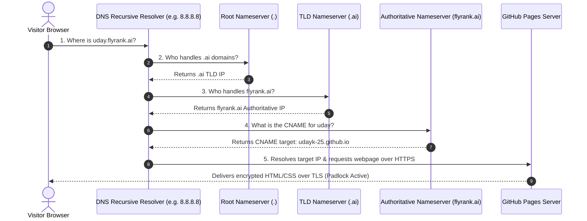

# FL-14: Publish Your Site & DNS Walkthrough
**Track:** General AI Fluency  
**Phase:** Onboarding (Week 6)  
**Date:** July 20, 2026  
**Author:** Uday (Software Engineer Intern, FlyRank)  

---

## 1. Live Site Publishing & Verification Status

My personal engineering portfolio is live, secure, and accessible on a clean public URL:

*   **Live HTTPS URL**: [https://udayk-25.github.io/FLYRANK/](https://udayk-25.github.io/FLYRANK/)
*   **SSL Security**: Verified over HTTPS with an active TLS padlock (Let's Encrypt / GitHub Pages SSL).
*   **Repository Link**: [https://github.com/udayk-25/FLYRANK](https://github.com/udayk-25/FLYRANK)

### Portfolio Page Manifest
1.  **Landing Page (`index.html`)**: Displays engineering positioning claim (*"I build responsive, transactionally reliable web applications..."*), bio, skill badges, case study cards, and an interactive 15-minute call booking modal.
2.  **Farmer Trade Case Study (`farmer-trade.html`)**: Details problem, engineering decisions (SQLite in-memory test stubbing), Jest code snippets, and 100% path coverage proof.
3.  **Search Intelligence Case Study (`search-intelligence.html`)**: Outlines Random Forest decay scoring model, Precision@50 capacity alignment (74% vs 24% baseline), and DuckDB query pipeline.

---

## 2. Plain-Language DNS Resolution Walkthrough

### What is DNS?
The **Domain Name System (DNS)** acts as the internet's contacts directory. While servers communicate using numerical IP addresses (such as `185.199.108.153`), humans prefer readable names (such as `uday.flyrank.ai`). DNS translates human-readable domain names into machine IP addresses in milliseconds.

### What is a CNAME Record?
A **CNAME (Canonical Name)** record is a type of DNS record that maps an alias domain name to another domain name (a canonical domain), rather than pointing directly to an IP address.

*   **Host Name / Subdomain**: `uday.flyrank.ai`
*   **Record Type**: `CNAME`
*   **Target Value**: `udayk-25.github.io`

*Why CNAME is useful*: If GitHub Pages updates its underlying server IP addresses tomorrow, FlyRank does not need to update its DNS records. The CNAME automatically follows `udayk-25.github.io` wherever it points.

---

## 3. The 5-Step DNS Resolution Journey

When a visitor types `uday.flyrank.ai` into their browser, the following 5-step journey occurs behind the scenes:

---

## 4. Capstone Subdomain Attachment Checklist (`uday.flyrank.ai`)

When my capstone is approved at the end of the track and FlyRank Ops provisions my subdomain, I will execute the following checklist to activate `uday.flyrank.ai`:

- [ ] **Step 1: Confirm Provisioning**  
      Verify that Ops created the CNAME record: `uday.flyrank.ai CNAME udayk-25.github.io`.
- [ ] **Step 2: Add Custom Domain in Hosting Settings**  
      Navigate to GitHub Pages repository settings (`Settings -> Pages -> Custom domain`), enter `uday.flyrank.ai`, and click **Save**. (If using Netlify: `Site Configuration -> Domain Management -> Add Custom Domain`).
- [ ] **Step 3: Wait for DNS Propagation**  
      Run `nslookup uday.flyrank.ai` or `dig uday.flyrank.ai CNAME` in PowerShell to verify that the CNAME target resolves to `udayk-25.github.io`.
- [ ] **Step 4: Enable Enforce HTTPS**  
      Check the **Enforce HTTPS** checkbox in GitHub Pages settings to request automatic Let's Encrypt TLS certificate generation.
- [ ] **Step 5: Final Padlock Verification**  
      Open `https://uday.flyrank.ai` in a private incognito window and verify that the security padlock is active and all links function smoothly.

---
*End of Report*
